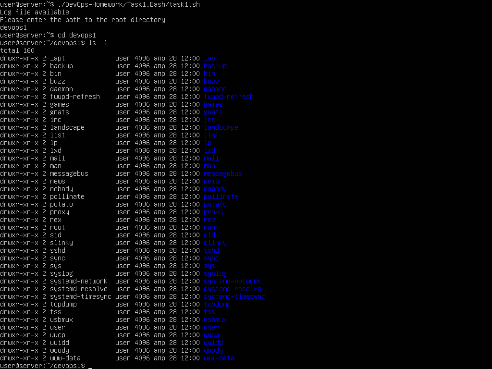
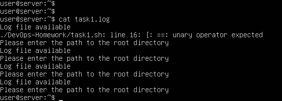

# Task 1. Bash
Bash script для создания директорий для всех пользователей системы.
### Требования.
- [x] Создание отдельных директорий для каждого пользователя системы.
- [x] Название директории - имя пользователя.
- [x] Владельцем директории является соответствующий пользователь.
- [x] Установлены права 755.
- [x] Директории создаются в корневом каталоге, заданном при выполнении скрипта с помощью ключа "-d".
- [x] Если ключ "-d" не задан, то для определения корневого каталога начинается "диалог" с пользователем.
- [x] Лог пишется и в stdout, и в отдельный файл (task1.log).
### Скриншоты.
#### Вариант использования с диалогом для определения корневого каталога:  
  
#### Вариант с использованием ключа "-d":  
  
#### Содержимое файла с логами:  
  
На последнем скриншоте видно, что
1) Логи добавляются, а не перезаписывают старый файл.
2) Ошибки тоже пишутся в файл (сначала вышла ошибка и соответствующий лог сохранился в файле, а после починки этой ошибки больше не возникало).
