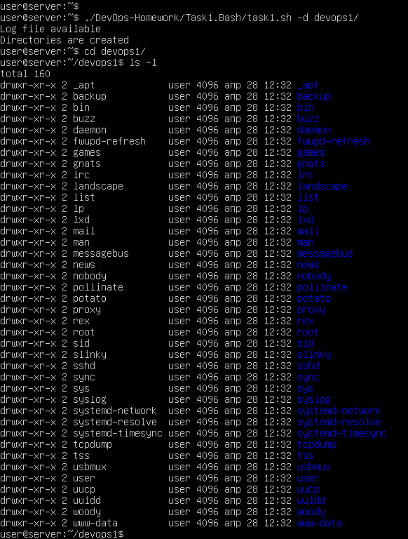
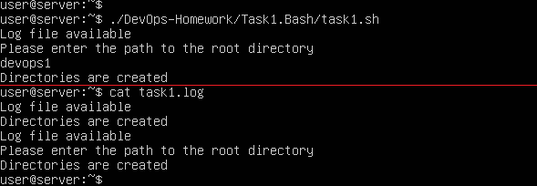

# Task 1. Bash
Bash script для создания директорий для всех пользователей системы.
### Требования.
- [x] Создание отдельных директорий для каждого пользователя системы.
- [x] Название директории - имя пользователя.
- [x] Владельцем директории является соответствующий пользователь.
- [x] Установлены права 755.
- [x] Директории создаются в корневом каталоге, заданном при выполнении скрипта с помощью ключа "-d".
- [x] Если ключ "-d" не задан, то для определения корневого каталога начинается "диалог" с пользователем.
- [x] Лог пишется и в stdout, и в отдельный файл (task1.log).
### Скриншоты.
#### Вариант использования с ключом "-d" + получившийся результат:  
  
#### Вариант использования с диалогом для определения корневого каталога + файл с логами:  
  
