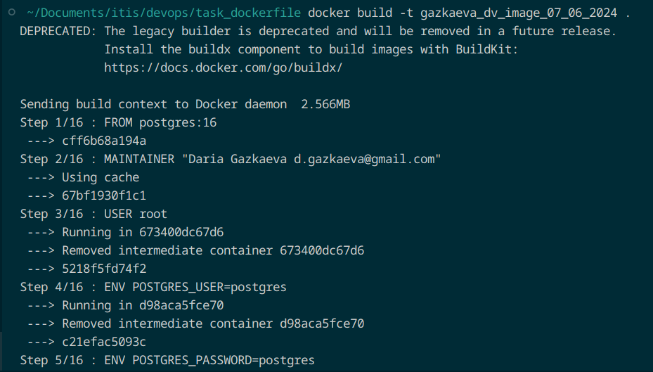
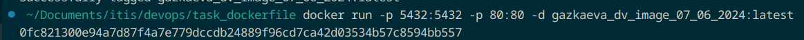
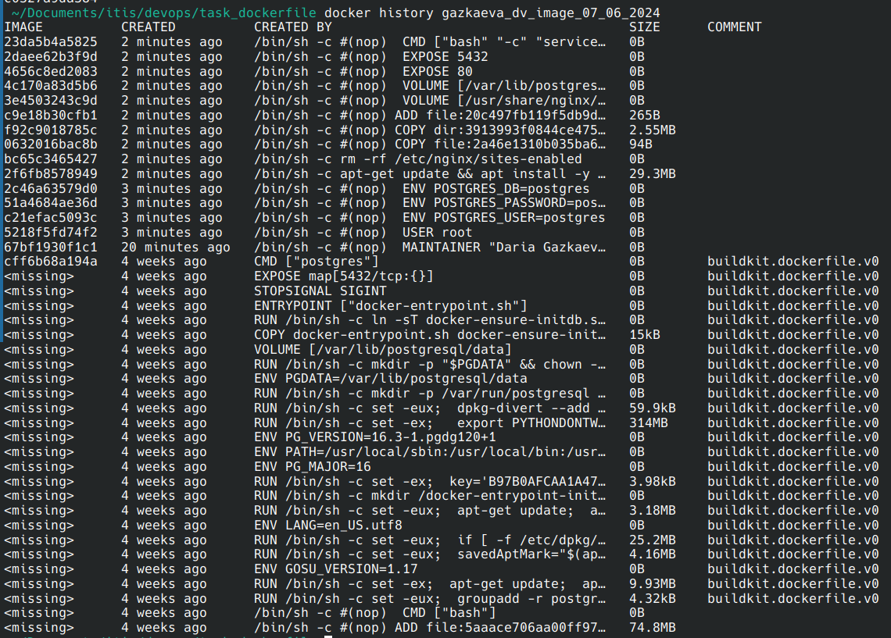
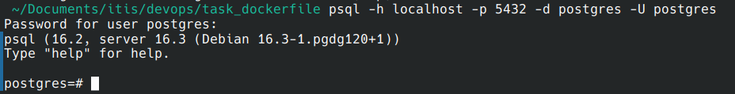
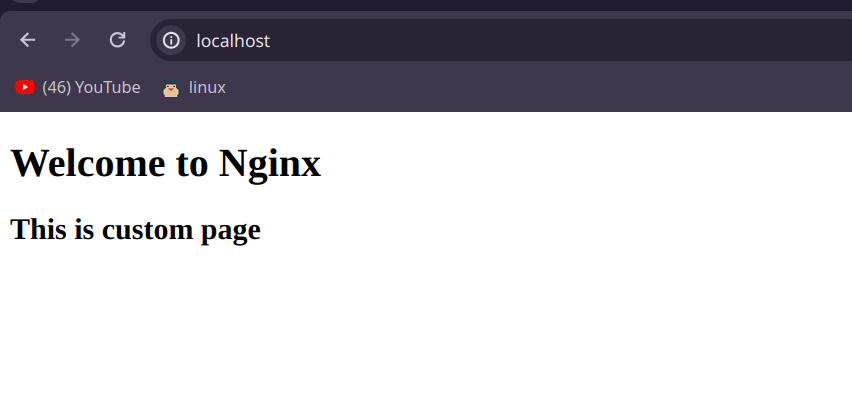
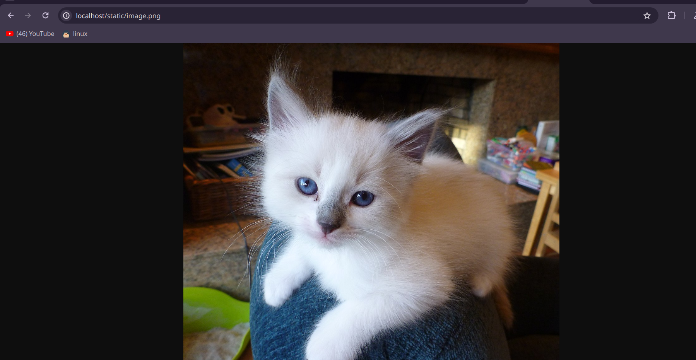

# Task 4. Dockerfile
### Требования.
- [x] Dockerfile для создания образа, который будет содержать Nginx и Postgres
- [x] Использовать инструкции: FROM, MAINTAINER, RUN, CMD, WORKDIR, ENV, ADD, COPY, VOLUME, USER, EXPOSE
- [x] Dockerfile должен содержать комментарии с пояснениями того, что делается
- [x] Собранный образ должен иметь имя вида <фамилия>_<инициалы>_image_<текущая дата>.
- [x] Скрин со всеми слоями image и их размер на диске + команда для вывода
### Отчет.
Собираем образ с помощью команды ``docker build -t gazkaeva_dv_image_07_06_2024``:  
  

Запуск:  
  

Слои и их размер с помощью команды ``docker history gazkaeva_dv_image_07_06_2024``:  
  

Postgres работает:  
  

Nginx работает:  
  

И статика тоже выводится:  
  
