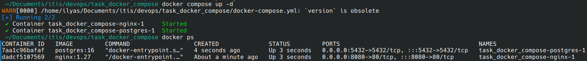
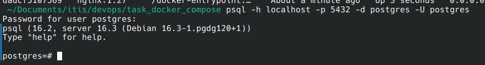

# Task 5. Docker-compose
### Требования.
- [x] docker-compose конфиг для разворачивания двух контейнеров (Nginx и Postgres) в одной сети
- [x] сеть 10.10.10.0/28 типа bridge
- [x] Nginx: должны передаваться конфигурационные файлы через volume
- [x] Nginx: порт 80 из контейнера должен быть доступен на хостовой машине по порту 8080
- [x] Postgres: каталог для хранения данных должен монтироваться как docker volume
- [x] Postgres: docker volume должен быть описан в том же конфигурационном файле docker compose
- [x] Postgres: сервис с БД должен быть доступен из контейнера с веб-сервером по именам new_db, dev_db
### Отчет.
Запускаем контейнеры ``docker compose up -d`` и смотрим запущенные ``docker ps``:  
  

Postgres работает:  
  

Nginx работает:  
  
